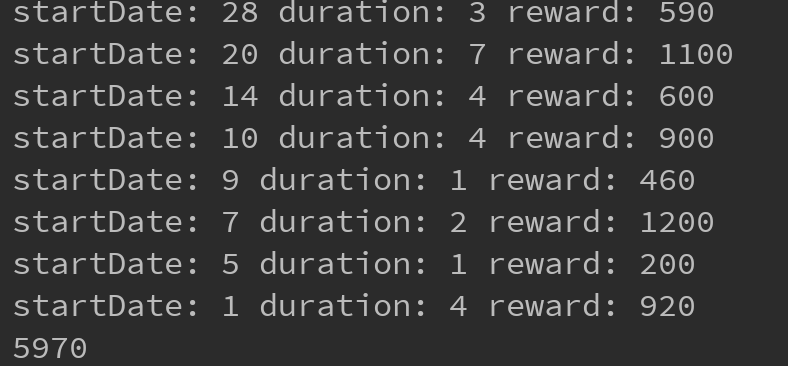

## Algorithm question's solution and explanation:

The code is in the `solution.java` file at the root, I used java to do this algorithm problem  
The solution is down below:  

The algorithm that I use is a `O((31)^2*n^2) = O(n^2)` algorithm, for n denotes the number of quests, I view the number of days, which is 31, as a constant here, if not, then the algorithm should be `O(n^2k^2)` for n denotes the number of days annd k denotes number of quests.

I used dynamic programming approach, for which I used a 2d array to store the imtermidiate result. `memo[i][j]` denotes that on ith day, if the jth quest is done, what is the current maximum rupees earned. For every `memo[i][j]`, it equals to the `rupees[j]` + the max value of all `memo[a][b]` where `a <= i - durations[j]`, which denotes the max values of rupees Link can earn before completing the current quest.

After the traversal, I return the max value in `memo`. I also added a feature that can show the particular quests Link can do to maximize the rupees, for which I use a 3d array, where it is indexed similarly as `memo`, but each value represents a pair of indexes that connects to a previous quest.